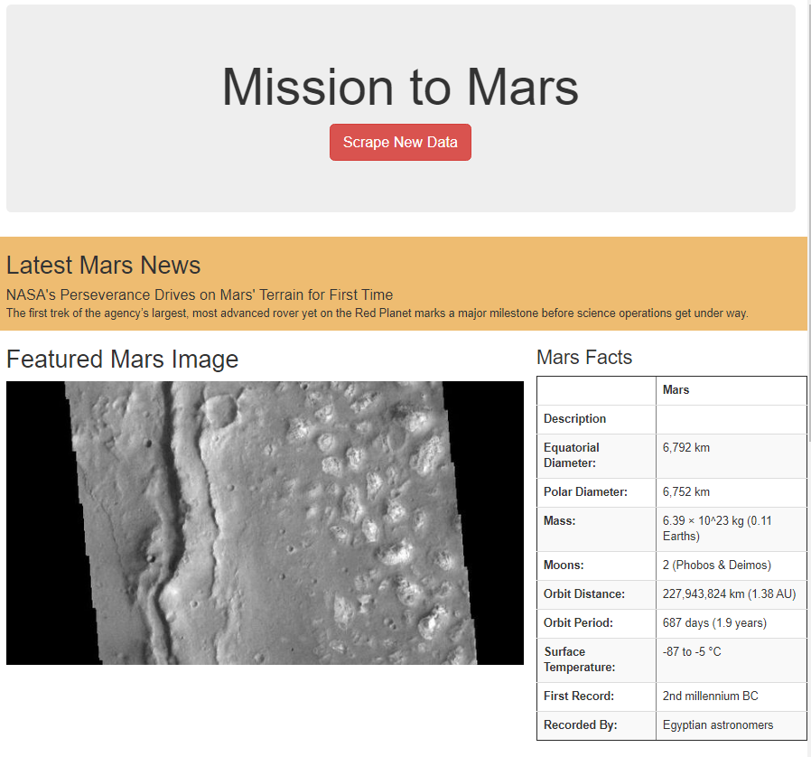
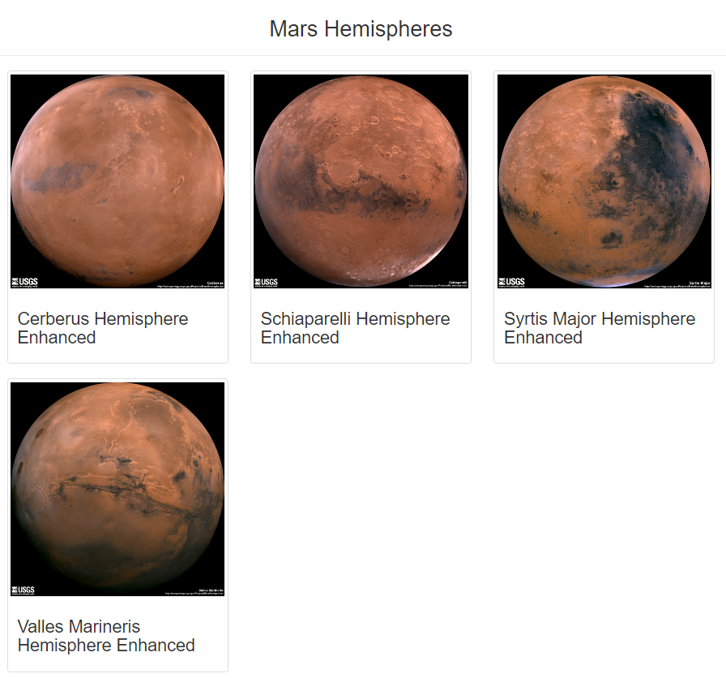

# Mission-to-Mars

## Project Overview

The Mission to Mars WebApp was developed to scrape data from various websites using BeautifulSoup and Splinter to provide the user with the following data:

- Latest news regarding Mars provided by NASA.
- A featured Image of Mars provided by JPL at the California Institute of Technology
- An array of facts about the planet.
- Full-resolution images and titles of the four hemispheres on Mars.

The following updates were also added to improve on the design, layout, and functionality of the original WebApp: 

- "Scape New Data" button colour change to align with the theme of the red planet.
  - [(ref: Line 19)](templates/index.html)
- Highlighted container for the "Latest Mars News" to capture the user’s attention. 
  - [(ref: Line 24)](templates/index.html)
- Adjusted Hemisphere image sizes and responsiveness to ensure proper visibility on various devices.
  - [(ref: Line 64, 66)](templates/index.html)

## Resources 

#### Software:
Anaconda 4.9.2, Jupyter Notebook 6.1.4, Python 3.8.5, Visual Studio Code 1.54.1

#### Data Files:
  - [Mission_to_Mars_Challenge.ipynb](Mission_to_Mars_Challenge.ipynb)
  - [scraping.py](scraping.py)
  - [app.py](app.py)
  - [index.html](templates/index.html)

## Preview

  

  

